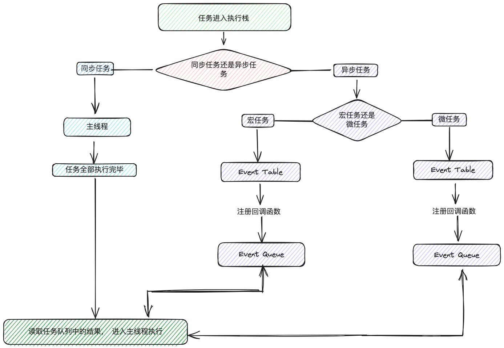
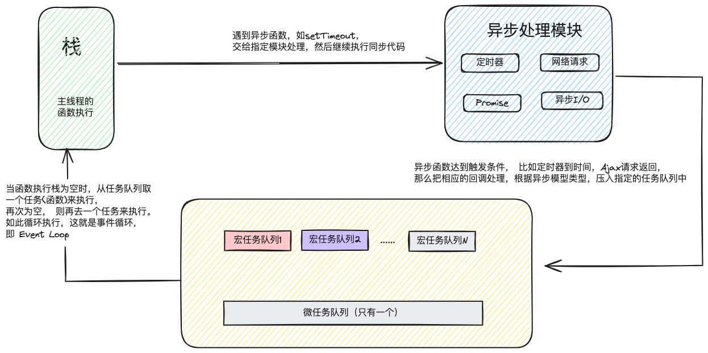

# NextTick

NextTick 是一个用于在下次 DOM 更新循环结束之后执行回调函数的方法。其内部原理涉及到 `Vue.js` 的异步更新队列以及浏览器的事件循环机制。

### 异步任务队列

 浏览器中，每个宏任务结束后都会检查微任务队列， 如果有任务则依次执行，当所有微任务执行完成后，才会执行下一个宏任务。 因此可以通过将任务作为微任务添加到微任务队列中，来确保任务在所有宏任务执行完毕后立即执行

 ::: info Javascript的事件运行机制

- **进程与线程**
  - 进程(`process`): 资源分配最小单位， 进程是应用的执行实例，是操作系统进行资源分配和调度的一个独立单位， 如果把计算机CPU必做一个工厂的话， 那么进程就相当于工厂中的车间， 代表CPU所能处理的单个任务
  - 线程(`thread`): 线程是进程内部的一个执行单元，是被系统独立调度和分派的基本单位， 系统创建好进程后， 实际上就启动执行了该进程的主执行线程， 线程则相当于车间里的工人， 一个车间会有多个工人在工作， 所以一个进程可以包含多个线程
  - **浏览器是多线程的， 所以它可以一次能够处理多个事件，比如渲染页面，脚本执行，事件处理等等**
  - **JS则是单线程的， 浏览器只给JS分配了一个线程**

- **执行栈与任务队列**
  - 执行栈：执行栈使用到的是数据结构中的栈结构，它是一个存储函数调用的栈结构， 遵循**先进后出**的原则， 它主要负责跟踪所有要执行的代码。每当一个函数执行完成时， 就会从堆栈中探出(pop)这个执行完成的函数， 如果有代码需要进去执行的话， 就进行push操作
  - 任务队列：任务队列使用到的是数据结构中的队列结构， 它用来保存异步任务，遵循 **先进先出**原则， 它主要负责将新的任务发送到队列中进行处理
  
  执行顺序： 先执行同步任务， 执行完接着执行微任务， 最后执行宏任务。 这个过程会不断重复



- **事件循环机制**



 **宏任务(`microtask`)**与**微任务(`macrotask`)**是指在事件循环中两种不同类型的任务

- **宏任务**
  - `script`全局代码
  - `setTimeout` 一次性定时器
  - `setInterval` 持续性定时器
  - `Node中的 setImmediate`
  - `I/O`
  - `UI-rendering`的交互事件

- **微任务**
  - `Promise.then(回调)`
  - `MutaionObserver`
  - `process.nextTick()`
  - `async await`
 :::

### **Vue2**

看下面一个例子，比如当DOM内容改变后， 我们需要获取的最新高度

```vue
<template>
  <div>{{name}}</div>
</template>

<script>
  data() {
    return {
      name: ''
    }
  },
  mounted() {
    console.log(this.$el.clientHeight) // 0
    this.name = '我的胃来食'
    // 在执行this.name = ‘我的胃来食’的时候， 就会触发`Watcher`更新，
    //  watcher会把自己放到一个队列
    console.log(this.$el.clientHeight) // 0
    this.$nextTick(()=> {
      console.log(this.$el.clientHeight) // 18
    });
  }
</script>
```

在watcher放到队列中后， 然后调用`nextTick()` 响应式派发更新的源码在这一块是这样的， 地址 `src/core/observer/scheduler.js`

```typescript
export function queueWatcher (watcher: Watcher) {
  ...
  // 因为每次派发更新都会引起渲染，所以把所有watcher都放到nextTick里调用
  nextTick(flushSchedulerQueue)
}
```

> 这里参数`flushSchedulerQueue`方法会被放到事件循环，主线程任务的行完成后就会执行这个函数， 对watcher队列排序、遍历执行watcher对应的run方法， 然后render， 更新视图
>
> 也就是说`this.name = '我的胃来食'`的时候， 任务队列可以简单理解成这样 `[flushSchedulerQueue]`
>
> 然后下一行`console.log(...)` 由于会更新视图的任务 `flushSchedulerQueue`在任务队列里没有执行，所以无法拿到更新后的视图
>
> 然后执行到`this.$nextTick(fn)`的时候， 添加一个异步任务，这时的任务队列可以简单理解成这样： `[flushSchedulerQueue, fn]`
>
> 然后同步任务就执行完了， 接着按顺序执行任务队列里的任务， 第一个任务执行就会更新视图， 后面自然而然地就得到更新后的视图了

#### nextTick源码

- vue2中nextTick源码 路径： `src/core/util/next-tick.js`
  
  - 这段源码分为两个部分， 一是判断当前环境能使用的最合适的`API`并保存异步函数， 二是调用异步函数执行回调队列

- 环境判断

  主要是判断用哪个宏任务或微任务， 因为宏任务耗费的时间是大于微任务的， 所以先使用微任务， 判断顺序如下

  - `Promise`
  - `MutationObserver`
  - `setimmediate`
  - `setTimeout`

```typescript
export let isUsingMicroTask = false  // 是否启用微任务开关
const callbacks = [] // 回调队列
let pending = false // 异步控制开关， 标记是否在执行回调函数

// 该方法负责执行队列中的全部回调
function flushCallbacks () {
  // 重置异步开关
  pending = false
  // 防止nextTick里有nextTick出现的问题
  // 所以执行之前就先备份并清空回调队列
  const copies = callbacks.slice(0)
  callbacks.length = 0
  // 执行任务队列
  for (let i = 0; i < copies.length; i++) {
    copies[i]()
  }
}
let timeFunc // 用来保存调用异步任务方法
// 判断当前环境是否支持原生 Promise
if (typeof Promise !== 'undefined' && isNative(Promise)) {
  // 保存一个异步任务
  const p = Promise.resolve()
  timeFunc = () => {
    // 执行回调函数
    p.then(flushCallback)
    // ios 中可能会出现一个回调被推入微任务队列，但是队列没有刷新的情况
    // 所以用一个空的计时器来强制刷新任务队列
    if (isIos) setTimeout(noop)
  }
  isUsingMicroTask = true
} else if (
  !isIE && typeof MutationObserver !== 'undefined' && 
  (
    isNative(MutationObserver) ||
     MutationObserver.toString() === '[object MutationObserverConstructor]')
  ) {
  // 不支持 Promise 的话， 在支持MutationObserver的非 IE 环境下
  // 如 PhantomJS ios7 Android 4.4
  let counter = 1
  const observer = new MutationObserver(flushCallbacks)
  const textNode = document.createTextNode(String(counter))
  observer.observe(textNode, { characterData: true })
  timerFunc = () => {
    counter = (counter + 1) % 2
    textNode.data = String(counter)
  }
  isUsingMicroTask = true
} else if (typeof setImmediate !== 'undefined' && isNative(setImmediate)) {
  // 使用setTmmediate 虽然也是宏任务， 但是比setTimeout更好
  timerFunc = () => {
    setImmediate(flushCallback)
  }
} else {
  // 以上都不支持的情况下， 使用setTimeout
  timerFunc = () => {
    setTimeout(flushCallbacks, 0)
  }
}
```

环境判断结束就会得到一个延迟回调函数`timeFunc`
然后进入核心的 nextTick

- **nextTick方法**

  这里的主要逻辑是
  - 把传入的回调函数放入回调队列`callbacks`,
  - 执行保存的异步任务 `timeFunc`， 就会遍历 `callbacks` 执行相应的回调函数了

```typescript
// 这三行是使用了 Typescript中的 函数重载
//  这里是 nextTick 方法的函数重载定义 ，用于在异步更新 DOM 之后执行回调函数。

// 这一行表示如果调用nextTick并且不传递任何参数，它会返回一个Promise<void>，用于处理异步操作
export function nextTick(): Promise<void>
// 这一行表示 如果调用nextTick并传递一个回调函数和一个上下文（this），
// 那么这个回调函数将以指定的上下文执行
export function nextTick<T>(this:T,cb:(this:T, ...args: any[]) => any): void
// 这一行表示 ，如果调用nextTick并传递一个回调函数和一个上下文（ctx），
// 那么这个回调函数将以指定的上下文执行。
export function nextTick<T>(cb:(this:T, ...args:any[]) => any, ctx:T): void

/**
 * @internal
 */
export function nextTick(cb?:(...args:any[]) => any, ctx?:object) {
  let _resolve
  // 把回调函数放入回调队列
  callbacks.push(() => {
    if (cb) {
      try {
        cb.call(ctx)
      } catch (e: any) {
        handleError(e, ctx, 'nextTick')
      }
    } else if (_resolve) {
      _resolve(ctx)
    }
  })
  if (!pending) {
    // 如果异步开关是开的， 就关闭， 表示正在执行回调函数，然后执行回调函数
    pending = true
    timeFunc()
  }
  // 如果没有提供回调，并支持Promise， 那么就返回Promise
  // 这里的 Promise 是让我们在不穿参数的情况下使用的， 
  // 具体使用： this.$nextTick().then(()=> { ... })
  // sflow-disable-time
  if (!cb && typeof Promise !== 'undefined') {
    return new Promise(resolve => {
      _resolve = resolve
    })
  }
}
```

### Vue3

  vue3的例子如下：

```vue
<template>
  <div ref="test">{{name}}</div>
  <button @click="handleClick">按钮</button>
</template>

<script lang='ts' setup>
  import { ref, nextTick } from 'vue'
  const name = ref<string>('我的胃来食')
  const test = ref(null)
  async function handleClick() {
    name.value = '测试'
    console.log(test.value.innerText) // 我的胃来食
    await nextTick()
    console.log(test.value.innerText) // 测试
  }
</script>
```

#### Vue3 nextTick源码

- 源码地址： `packages/runtime-core/src/sheduler.ts`

```typescript
const resolvedPromise: Promise<any> = Promise.ressolve()
let currentFlushPromise: Promise<void> | null = null

export function nextTick<T = void>(this:T, fn?:(this:T) => void): Promise<void> {
  const p = currentFlushPromise || resolvePromise
  return fn ? p.then(this ? fn.bind(this): fn) : p
}
```

可以看出nextTick接受一个函数为参数，同时会创建一个微任务

在页面调用`nextTick`的时候，会执行该函数， 把我们的参数 `fn` 赋值给p.then(fn) 在队列的任务完成后， fn就执行了

由于加了几个维护队列的方法， 所以执行顺序是这样的：

 `queueJob` -> `queueFlush` -> `flushJobs` -> `nextTick参数的 fn`

- `queueJob()`
    这个方法负责维护主任务队列，接受一个函数做为参数，为 待入队 任务， 会将参数`push` 到 `queue`队列中， 有唯一性判断。 会在当前宏任务之行结束后，清空队列

```typescript
const queue: SchedulerJob[] = []
export function queueJob(job: SchedulerJob) {
  // 主任务队列为空 或者 有正在执行的任务并且没有在主任务队列中 && job 不能和当前正在执行任务以及后面带执行任务相同 
  if ((!queue.length|| !queue.includes(job, isFlushing && job.allowRecurse ? flushIndex + 1 : flushIndex))
  && job !== currentPreFlushParentJob
  ) {
    // 可以入队就添加到主任务队列
    if (job.id  == null) {
      queue.push(job)
    } else {
      // 否则就插入到头部
      queue.splice(findInsertionIndex(job.id), 0, job)
    }
    // 创建微任务
  }
}
```

- `queueFlush()`
    这个方法负责尝试创建微任务，等待任务队列执行

```typescript
let isFlushing = false // 是否正在执行
let isFlushPending = false // 是否正在等待执行
const resolvePromise: Promise<any> = Promise.resolve() // 微任务创建器
let currentFlushPromise: Promise<void> | null = null // 当前任务

function queueFlush() {
  // 当前没有微任务
  if (!isFlushing && !isFlushPending) {
    // 避免在事件循环周期内多次创建新的微任务
    isFlushPending = true
    // 创建微任务，把flushJobs推入到任务队列等待执行
    currentFlushPromise = resolvedPromise.then(flushJobs)
  }
}
```

- `flushJobs`
  
  这个方法负责处理队列任务， 主要逻辑如下

  - 先处理前置任务队列
  - 根据`id`排队队列
  - 遍历执行队列任务
  - 执行完毕后清空并重置队列
  - 执行后置队列任务
  - 如果还有就递归继续执行
  
```typescript
function flushJobs(seen?: CountMap) {
  isFlushPending = false // 是否正在等待执行
  isFlushing = true // 正在执行
  if (__DEV__) seen = seen || new Map() // 开发环境下
  flushPreFlushCbs (seen) // 执行前置任务队列
  // 根据 id 排序队列， 以确保
  // 1. 从父到子， 因为父级总是在子级前面先创建
  // 2. 如果符组件更新期间卸载了组件， 就可以跳过
  queue.sort((a, b) => getId(a) - getId(b))
  try {
    // 遍历主任务队列，批量执行更新任务
    for (flushindex = 0; flushindex < queue.length; flushIndex++) {
      const job = queue(flushIndex)
      if (job && job.active !== false) {
        if (__DEV__ && checkRecursiveUpdates(seen!, job)) {
          continue
        }
        callWithErrorHandling(job, null, ErrorCodes,.SCHEDULER)
      }
    }
  } finally {
    flushIndex = 0 // 队列任务执行完， 重置队列索引
    queue.length = 0 // 清空队列
    flushPostFlushCbs(seen) // 执行后置队列任务
    isFlushing = false // 重置队列执行状态
    currnetFlushPromise = null // 重置当前微任务为 null
    // 如果住任务队列， 前置和后置任务队列还没有被清空，就继续递归执行
    if (queue.length || pendingPreFlushCbs.length || pendingPostFlushCbs.length) {
      flushJobs(seen)
    }
  }
}
```

- `flushPreFlushCbs()`
  这个方法负责执行前置任务队列

```typescript
export function flushPreFlushCbs (seen?:CountMap, parentJob: SchedulerJob| null = null) {
  // 如果待处理的队列不为空
  if (pendingPreFlushCbs.length) {
    currentPreFlushParentJob = parentJob
    // 保存队列中去重后的任务为当前活动的队列
    activePreFlushCbs = [...new Set(pendingPreFlushCbs)]
    // 清空队列
    pendingPreFlushCbs.length = 0
    // 开发环境下
    if (__DEV__) { seen = seen || new Map()} 
    // 遍历执行队列里的任务
    for ( preFlushIndex = 0; preFlushIndex < activePreFlushCbs.length; preFlushIndex++) {
      // 开发环境下
      if (__DEV__ && checkRecursiveUpdates(seen!, activePreFlushCbs[preFlushIndex])) {
        continue
      }
      activePreFlushCbs[preFlushIndex]()
    }
    // 清空当前活动的任务队列
    activePreFlushCbs = null
    preFlushIndex = 0
    currentPreFlushParentJob = null
    // 递归执行， 直到清空前置任务队列， 再往下执行异步更新队列任务
    flushPreFlushCbs(seen, parentJob)
  }
}
```

- `flushPostFlushCbs()`
  这个方法负责执行后置任务队列

```typescript
let activePostFlushCbs: SchedulerJob[] | null = null
export function flushPostFlushCbs(seen?:CountMap) {
  // 如果待处理的队列不为空
  if (pendingPostFlushCbs.length) {
    // 保存队列中去重后的任务
    const deduped = [...new Set(pendingPostFlushCbs)]
    // 清空队列
    pendingPostFlushCbs.length = 0
    // 如果当店已经有活动的队列， 就添加到执行队列的末尾，并返回
    if (activePostFlushCbs) {
      activePostFlushCbs.push(...deduped)
      return
    }
    // 赋值为当前活动队列
    activePostFlushCbs = deduped
    // 开发环境下
    if (__DEV__) seen = seen || new Map()
    // 排列队列
    activePostFlushCbs.sort((a, b) => getId(a) - getId(b))
    // 遍历执行队列里的任务
    for (postFlushIndex = 0; postFlushIndex < activePostFlushCbs.length; postFlushIndex++) {
      if (__DEV__ && checkRecursiveUpdates(seen!, activePostFlushCbs[postFlushIndex])) {
        continue
      }
      activePostFlushCbs[postFlushIndex]()
    }
    // 清空当前活动的任务队列
    activePostFlushCbs = null
    postFlushIndex = 0
  }
}
```

### 引用

 [一次弄懂 Vue2 和 Vue3 的 nextTick 实现原理](https://juejin.cn/post/7021688091513454622?from=search-suggest)

 [vue2源码nextTick](https://github.com/vuejs/vue/blob/main/src/core/util/next-tick.ts)

 [vue3源码nextTick](https://github.com/vuejs/core/blob/main/packages/runtime-core/src/scheduler.ts)
