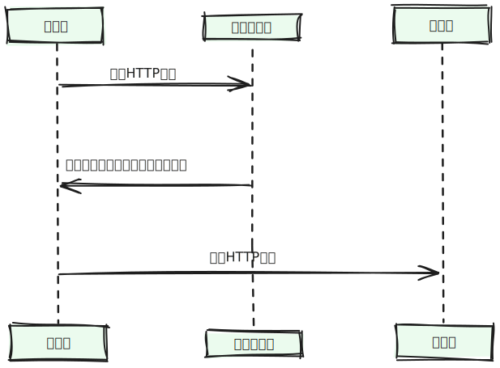

# 浏览器缓存

当用户打开网站并进行交互时，网站所需的所有资源，包括 HTML、JavaScript、CSS、图片、字体以及应用程序明确请求的任何数据，都是通过发出 HTTP(S)请求来获取的， PWA的一个基本特性就是
能够明确地将一些应用程序的资源缓存在设备上，这意味着它们可以在不需要向网络发送请求的情况下而被检索

### 优点

- **离线操作**： 缓存使PWA能够在设备没有网络连接时进行工作
- **响应速度** 即使设备子啊线，如果其用户界面是从缓存中获取的， PWA通常会更加反应迅速

### 浏览器缓存过程

缓存命中机制流程

1. 发送请求，根据请求头的 Expires和 cache-control(强缓存)判断是否命中(过期)，如果命中则直接从缓存中获取资源，否则进入下一步
2. 没有命中强缓存。则根据请求头的 last-modified 和 etag 判断是否命中协商缓存，如果命中，直接从缓存中获取资源， 如果没有命中，则进入下一步
3. 如果前两步都没有命中，则直接从服务端获取资源
  
**强缓存与协商缓存的区别**

- 强缓存不会发送到服务器，资源更新了可能浏览器还不知道
- 协商缓存会发送请求给服务器，通过字段， 服务器能够知道是否更新
- 大部分Web浏览器默认开启协商缓存

> 关于浏览器普通刷新和强制刷新的区别
> - 强制刷新: 会直接从服务器获取最新资源，跳过强缓存和协商缓存
> - 普通刷新: 跳过强缓存，但还是会检查协商缓存

#### 强缓存

强制缓存就是向浏览器缓存查找该请求结果，并根据该结果的缓存规则来决定是否使用该缓存结果的过程，强制缓存的情况主要有三种

- 不存在该缓存结果和缓存标识，强制缓存失效，则直接向服务器发起请求(跟第一次发起请求一致)

  

- 存在该缓存结果和缓存标识，但结果已失效，强制缓存失效，则使用协商缓存
  
  

- 存在该缓存结果和缓存标识，且该结果尚未失效，强制缓存失效

  

##### 强缓存规则

当浏览器向服务器发送请求时，服务器会将缓存规则放入HTTP响应报文的HTTP头中和请求结果一起返回给浏览器，控制强制缓存的字段分别是`Expires`和`Cache-Control`, 其中`Cache-COntrol`的优先级
比`Expires`优先级高

- **`Expires`**

  `Expires`是HTTP/1.0控制网页缓存的字段，其值为服务器返回该请求结果缓存的到期时间，即再次发起该请求时，如果客户端的事件小于`Expires`时，直接使用缓存结果。

  > Expires是HTTP/1.0的字段，但是现在浏览器默认使用的是HTTP/1.1

  到了HTTP/1.1，`Expires`已经被`Cache-Control`替代， 原因在于`Expires`控制缓存的原理是使用客户端的事件与服务端返回的时间作对比，那么客户端与服务端的时间因为某些原因(例如时区不同;
  客户端与服务端有一方时间不准确)发生误差，那么强制缓存则会直接失效，这样的话强制缓存的存在就毫无意义。

- **`Cache-Control`**
  
  在HTTP/1.1中, `Cache-Control`是最重要的规则，主要用于控制网页缓存，取值有以下几种：

  |属性|功能|
  |:---|:---|
  |`public`|所有内容都被缓存(客户端和代理服务都可缓存)|
  |`private`|所有内容只有客户端可以缓存，`Cache-Control`的默认取值|
  |`no-cache`|客户端缓存内容，但是是否使用缓存则需要经过协商缓存来验证决定|
  |`no-store`|所有内容都不会被缓存，即不使用强制缓存，也不使用协商缓存|
  |`max-age=xxx`(`xxx`是数字)|缓存内容将在xxx秒后失效|

  

  从上述示例中可以看到：

  HTTP响应报文中`Expires`的时间值，是一个绝对值；

  HTTP响应报文中的`Cache-Control`为 max-age=600, 是相对值

  由于`Cache-Control`优先级高于`Expires`, 那么直接根据`Cashe-Control`的值进行混存，意思是在600秒内再次发起这个请求，则会直接使用缓存结果，强制缓存生效。

  :::info ⚠️
  在无法确定客户端的事件是否与服务端的事件同步的情况下，`Cache-Control`相比于`Expires`是更好的选择， 所以同时存在时，只有`Cache-Control`生效
  :::

**如何在浏览器中判断强制缓存是否生效**

关于Chrome网络请求的Size， 可能会出现三种情况：

- `form disk cache`(磁/硬盘缓存)

  不请求网络，资源在磁盘中，一般非脚本会存放在内存中，如 CSS等

  硬盘缓存是直接将缓存写在硬盘文件中，读取缓存需要对该缓存存放的硬盘文件进行I/O操作，然后重新解析该缓存的内容，读取复杂，速度比内存缓存慢

- `form memory cache`(内存缓存)

  不请求网络，资源在内存中，一般脚本、字体、图片会存在内存中

  内存缓存具有**快速读取**和**时效性**

  > 快速读取: 内存缓存会讲编译解析后的文件，直接存入该进程的内存中，占据该进程一定的内存资源，以方便下次运行使用时的快速读取

  > 时效性: 一旦进程关闭，则该进程的内存则会清空。

- 资源大小数值: 从服务器下载最新资源

> 浏览器读取缓存的顺序是 `memory` -> `disk`

#### 协商缓存

协商缓存是缓存失效后，浏览器携带混存表示向服务器发起请求，由服务器根据缓存标识决定是否使用缓存的过程，主要分为两种情况

- 协商缓存生效， 返回304:
  
  

- 协商缓存失效，返回200和请求结果:

 

##### 协商缓存规则

协商缓存的标识也是在响应报文的HTTP头中和请求结果一起返回给浏览器的，控制协商缓存的分别有`Last-Modified`/`If-Modified-Since`和`Etag`/`If-None-Match`, 其中`Etag`/`If-None-Match`
的优先级比 `Last-Modified`/`If-Modified-Since`高。

- **`Last-Modified`/`If-Modified-Since`**

  `Last-Modified`是服务器响应请求时，返回该资源文件在服务器最后被修改的时间

  `If-Modified-Since`则是客户端再次发起该请求时，携带上次请求返回的`Last-Modified`的值，通过此字段告诉服务器 该资源上次请求返回的最后被修改时间，服务器收到该请求，发现请求头
  含有`If-Modified-Since`字段后， 然后根据`If-Modified-Since`的字段值与该资源在服务器的最后被修改时间做对比，若服务器的资源最后被修改时间大于`If-Modified-Sinde`的字段值，则
  重新返回该资源，状态码为*200*，否则返回*304*，代表资源无更新，可继续使用缓存文件
  
- **`Etag`/`If-None-Match`**

  `Etag`是服务器响应请求时，返回当前资源文件的一个唯一标识(由服务器生成)

  `If-None-Match`是客户端再次发起请求时，携带上次请求返回的唯一标识`Etag`值，通过此字段值告诉服务器 该资源上起请求返回的唯一标识值，服务器收到该请求后，发现该请求头中
  含有`If-None-Match`，则会根据`If-None-Match`的字段值与该资源在服务器的Etag值作对比， 两者一致时返回*304*， 代表资源无更新，继续使用缓存文件，不一致则重新返回资源文件，
  状态码为*200*

:::info ⚠️
  `Etag`/`If-None-Match`优先级高于`Last-Modified`/`If-Modified-Since`,同时存在则只有`Etag`/`If-None-Match`生效
:::

### 总结

 强制缓存优先于协商缓存进行， 若强制缓存(`Expires`和`Cache-COntrol`)生效则直接使用缓存，若不生效则进行协商缓存(`Last-Modified`/`If-Modified-Since`和`Etag`/`If-None-Match`)，
 协商缓存由服务器决定是否使用缓存， 若协商缓存失效，那么代表该请求的缓存失效，重新获取请求结果，在存入到浏览器阿訇； 生效则返回*304*， 继续使用缓存

## 引用

[彻底理解浏览器的缓存机制](https://mp.weixin.qq.com/s/d2zeGhUptGUGJpB5xHQbOA)

[浏览器缓存相关](https://chodocs.cn/interview/browser/cache.html)
